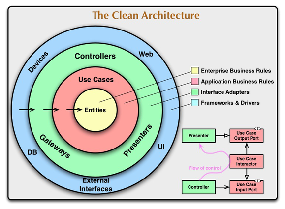
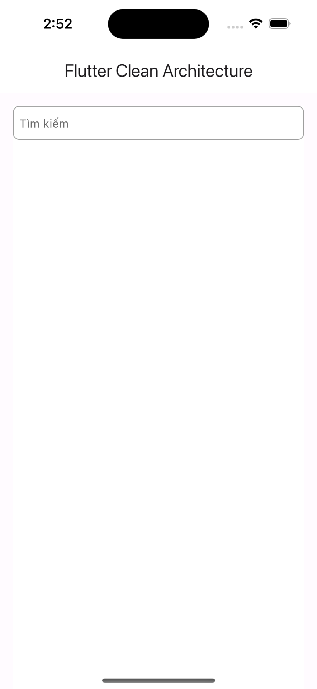
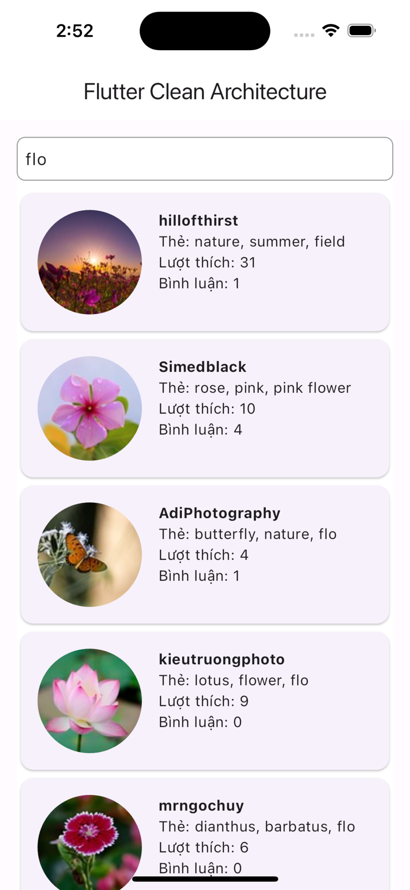

## 🚀 Project using Clean Architecture recommend by Google Developer
This guide encompasses best practices and recommended architecture for building robust, high-quality apps
- [Guide to app architecture (Gooogle Developers)](https://developer.android.com/topic/architecture?continue=https%3A%2F%2Fdeveloper.android.com%2Fcourses%2Fpathways%2Fandroid-architecture%3Fhl%3Dvi%23article-https%3A%2F%2Fdeveloper.android.com%2Ftopic%2Farchitecture)
## Medium
- [Read Medium about my article](https://medium.com/@jyxjrpp/clean-architecture-trong-react-native-3b2c5c5bf3e)
## 🚀 Introduction
This sample demonstrates how one can

- Setup base architecture of Flutter app using Clean Architecture
- Use dependency injection for layers separation
- Make api calls using Axios plugin.

```
├── common
|   └── helper
├── data
|   ├── config
|   ├── datasources
|   ├── gateway
|   ├── helper
|   ├── models
|   └── repositories
├── di (dependency injection)
├── domain 
|   ├── entities
|   ├── repositories
|   └── usecases
└── presentation
    ├── assests
    ├── components
    ├── contants
    ├── features
    ├── localizations
    ├── navigations
    └── utils
```

#### Dependencies
- [Dio](https://pub.dev/packages/dio) : http client
- [Get_it](https://pub.dev/packages/get_it) : dependency injection
- [Flutter_bloc](https://pub.dev/packages/flutter_bloc) : Flutter Widgets that make it easy to implement the BLoC (Business Logic Component) design pattern
- [Rxdart](https://pub.dev/packages/rxdart) : RxDart extends the capabilities of Dart Streams and StreamControllers.
- [Dartz](https://pub.dev/packages/dartz) : Functional programming in Dart.

## 🚀 Module Structure


There are 3 main modules to help separate the code. They are Data, Domain, and Presentaion.

- **Data** contains Local Storage, APIs, Data objects (Request/Response object, DB objects), and the repository implementation.

- **Domain** contains UseCases, Domain Objects/Models, and Repository Interfaces

- **Presentaion** contains UI, View Objects, Widgets, etc. Can be split into separate modules itself if needed. For example, we could have a module called Device handling things like camera, location, etc.

## 🚀 Flutter version: channel stable
```
environment:
  sdk: '>=3.2.0-16.0.dev <4.0.0'
  dart: ">=3.2.0-16.0.dev <4.0.0"
  flutter: ">=3.10.0"
```
```
Flutter 3.19.6 • channel stable • https://github.com/flutter/flutter.git
Framework • revision 54e66469a9 (5 days ago) • 2024-04-17 13:08:03 -0700
Engine • revision c4cd48e186
Tools • Dart 3.3.4 • DevTools 2.31.1
```

## 🚀 Detail overview
- Using modular architecture to architect the app per feature to be easier and more readable and isolate the feature from each other

### Repository
- Bridge between Data layer and Domain layer
- Connects to data sources and returns mapped data
- Data sources include DB and Api

#### - DataSource:
```dart
class PhotoRemoteDataSourceImpl implements PhotoRemoteDataSource {
  final RestApiGateway _restApiGateway;

  PhotoRemoteDataSourceImpl(this._restApiGateway);

  @override
  Future<Either<Failure, dynamic>> getPhoto(RequestPhoto? reqParams) async {
    try {
      final response = await _restApiGateway.dio.get(
          "?key=${API_KEY}q=${reqParams?.query}&page=${reqParams?.page}&per_page=20");
      if (response.statusCode == 200) {
        var decode = Photos.fromJson(response.data);
        return Right(decode);
      } else {
        return const Left(ServerFailure('Lỗi xảy ra'));
      }
    } on DioError catch (error) {
      return const Left(ServerFailure('Lỗi xảy ra'));
    }
  }
}
```

#### - RepositoryImpl:
```dart
class PhotoRepositoryImpl implements PhotoRepository {
  final PhotoRemoteDataSource _dataSource;

  PhotoRepositoryImpl(this._dataSource);

  @override
  Future<Either<Failure, dynamic>> getPhoto(RequestPhoto? reqParams) async {
    return await _dataSource.getPhoto(reqParams);
  }
}
```

### Domain
- Responsible for connecting to repository to retrieve necessary data. returns a Stream that will emit each update.
- This is where the business logic takes place.
- Returns data downstream.
- Single use.
- Lives in Domain (No Platform dependencies. Very testable).

#### - UseCase:
```dart
class GetPhotoUseCase implements BaseUseCase<dynamic, RequestPhoto> {
  final PhotoRepository repository;

  GetPhotoUseCase(this.repository);

  @override
  Future<Either<Failure, dynamic>> execute(RequestPhoto? reqParams) async {
    return await repository.getPhoto(reqParams);
  }
}
```

### Presentation (Holder)
- Organizes data and holds View state.
- Talks to use cases.
```dart
class PhotoCubit extends Cubit<PhotoState> {
  /// Input
  final Sink<String?> search;
  final Function0<void> dispose;
  final Function0<void> onLoadMore;
  final Function0<void> onRefresh;

  /// Output
  final Stream<PhotoState?> results$;

  factory PhotoCubit(final GetPhotoUseCase getPhoto) {
    final currentPage = BehaviorSubject<int>.seeded(1);
    final onLoadMore = BehaviorSubject<void>();
    final onRefresh = BehaviorSubject<void>();
    final textChangesS = BehaviorSubject<String>();
    final List<Hits> appendPhotos = [];

    final loadMore$ = onLoadMore.doOnData((event) {
      var nextPage = currentPage.value + 1;
      currentPage.add(nextPage);
    }).withLatestFrom(textChangesS, (_, s) => textChangesS.value);

    final refresh$ = onRefresh.doOnData((event) {
      currentPage.add(1);
    }).withLatestFrom(textChangesS, (_, s) => textChangesS.value);

    final search$ = textChangesS.doOnData((event) {
      currentPage.add(1);
    });

    final results = Rx.merge([refresh$, search$, loadMore$])
        .debounceTime(const Duration(milliseconds: 350))
        .switchMap((String keyword) {
      if (keyword.isEmpty) {
        return Stream.value(null);
      } else {
        return Stream.fromFuture(getPhoto
                .execute(RequestPhoto(query: keyword, page: currentPage.value)))
            .flatMap((either) => either.fold((error) {
                  return Stream<PhotoState?>.value(
                      PhotoError(error.message.toString()));
                }, (data) {
                  FocusManager.instance.primaryFocus?.unfocus();
                  if (currentPage.value == 1) {
                    appendPhotos.clear();
                  }
                  appendPhotos.addAll(data.hits);
                  return Stream<PhotoState?>.value(PhotoLoaded(
                      data: appendPhotos,
                      currentPage: currentPage.value,
                      hasReachedMax: appendPhotos.length < data?.totalHits));
                }))
            .startWith(const PhotoLoading())
            .onErrorReturnWith(
                (error, _) => const PhotoError("Đã có lỗi xảy ra"));
      }
    });
    return PhotoCubit._(
      search: textChangesS.sink,
      onLoadMore: () => onLoadMore.add(null),
      onRefresh: () => onRefresh.add(null),
      results$: results,
      dispose: () {
        textChangesS.close();
        currentPage.close();
        onLoadMore.close();
        onRefresh.close();
      },
    );
  }

  PhotoCubit._({
    required this.search,
    required this.onRefresh,
    required this.onLoadMore,
    required this.results$,
    required this.dispose,
  }) : super(const PhotoInitial());
}
```

### Presentation (View)
- View,updates UI

## 🚀 Screenshoots

|               Default Search                |          Search keyword (ex: flo)           |
|:-------------------------------------------:|:-------------------------------------------:|
|  |  |
